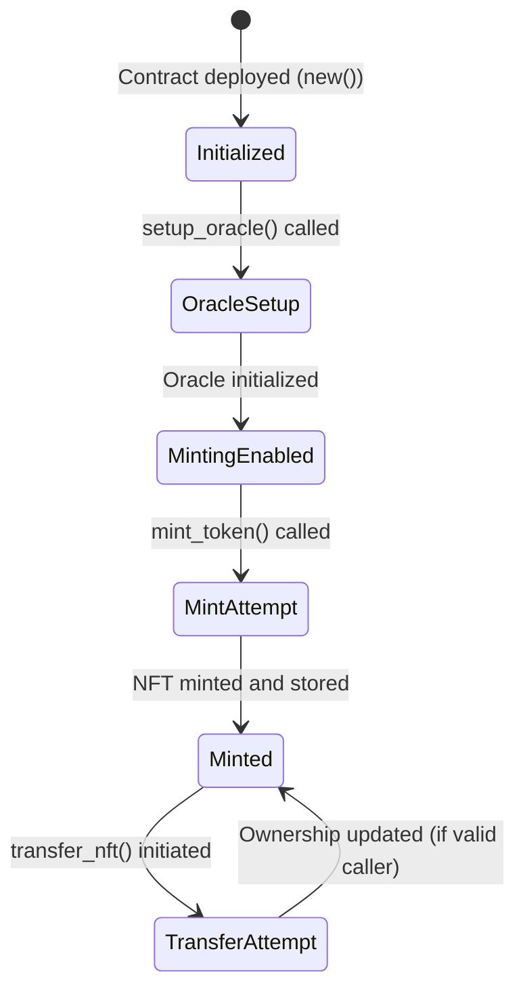
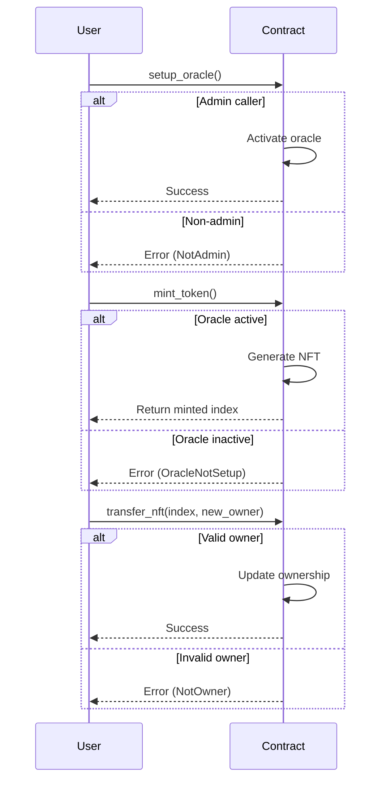

# A simple NFT Minting Machine

This contract allows you to mint Non-Fungible Tokens (NFTs) with a unique identifier and manage their ownership. It provides a simple mechanism to initialize an oracle for tracking the NFT minting state and facilitates secure ownership transfer of minted NFTs.

## Key Features

| Feature                          | Description                                                              |
|----------------------------------|--------------------------------------------------------------------------|
| **Admin Control**                | The deployer of the contract is the admin and can initialize the oracle  |
| **NFT Minting**                  | Users can mint NFTs with automatically incremented token names           |
| **Ownership Transfer**           | Ownership of minted NFTs can be securely transferred                     |
| **Oracle Initialization**        | Admin initializes the oracle to enable minting                           |
| **NFT Retrieval**                | Retrieve details of a minted NFT by its unique index                     |

### Data Structures

| Component             | Type                         | Description                                                         |
|-----------------------|------------------------------|---------------------------------------------------------------------|
| **Nft**               | `struct`                     | Represents an NFT record with a token name and owner                |
| **OracleData**        | `struct`                     | Holds the current NFT mint counter                                  |
| **Error**             | `enum`                       | Custom error types for contract operations                          |
| **NFTMintingMachine** | `struct`                     | The main storage structure of the contract                          |

## Functions Overview

### `new()` - Initializes the Contract

- **Key Points:**
  - Sets the deployer as admin  
  - Uses default values for storage  

### `setup_oracle()` - Initializes the Oracle

- **Key Points:**
  - Only the **admin** can call this function  
  - Enables minting by setting up the oracle  

### `mint_token()` - Mints a New NFT

- **Key Points:**  
  - Checks if the oracle is initialized  
  - Increments the NFT counter  
  - Generates a token name like "NFT #`counter`  
  - Registers the NFT with the caller as the owner  

### `transfer_nft(nft_index: u64, new_owner: AccountId)` - Transfers Ownership

- **Key Points:**  
  - Verifies the caller is the current owner  
  - Updates the NFT record with the new owner  

### `get_oracle_data()` - Retrieves Current Oracle Data

- **Key Points:**  
  - Returns the current NFT mint counter  

### `get_nft(index: u64)` - Retrieves an NFT Record

- **Key Points:**  
  - Returns the NFT record if found  

## State Diagram

## Sequence Diagram

